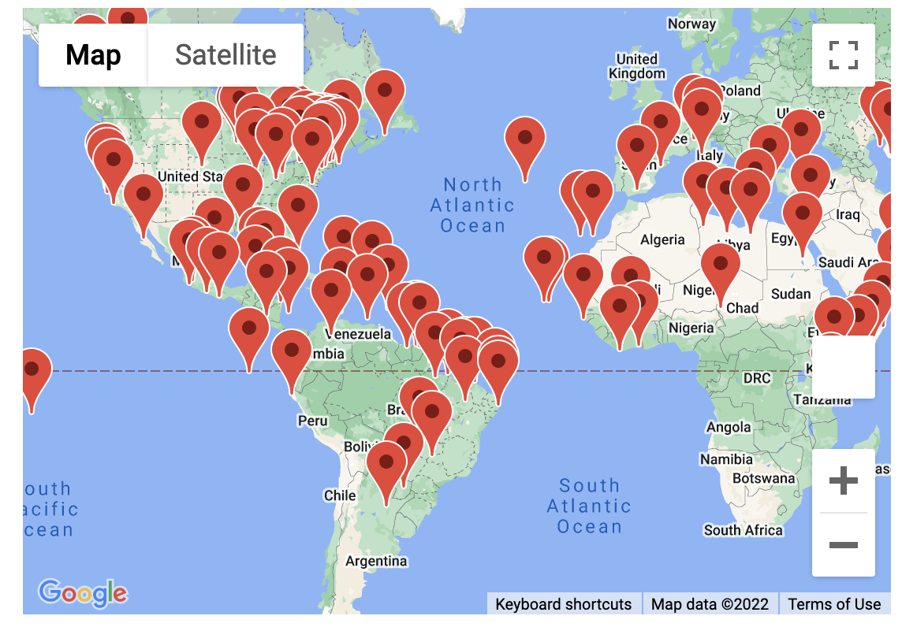
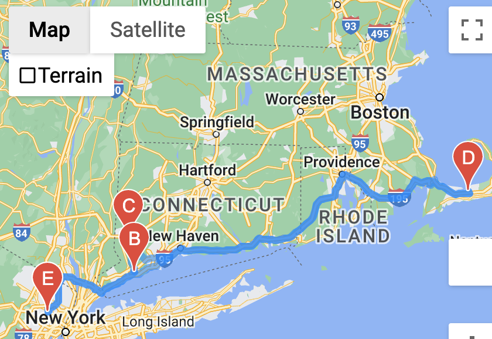
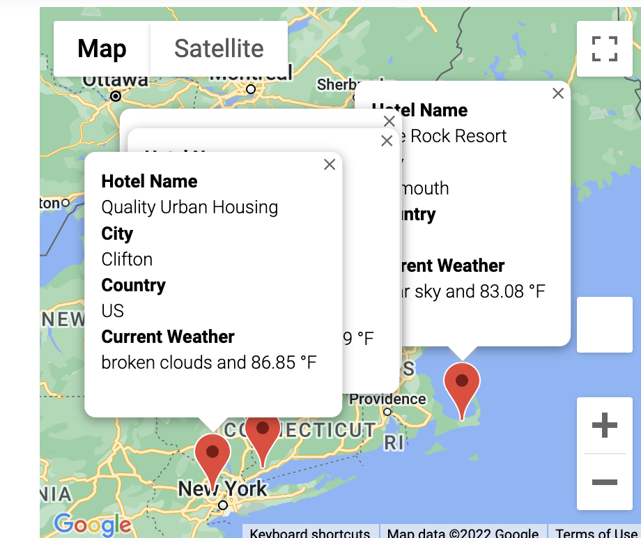

# World Weather Analysis

## Purpose and Overview

The objective of this project is to gather and present comprehensive data for PlanMyTrip customers, enabling them to discover the finest hotels worldwide. This endeavor involved utilizing Jupyter Notebook, Matplotlib, and API calls to construct a series of visually informative maps, facilitating the identification of optimal itineraries.

## Analysis

The initial step entailed generating a map encompassing all cities that fell within the customers' preferred temperature range. To accomplish this, an API call was made, plotting the locations of hotels situated within the desired temperature range.

Subsequently, four cities were identified that aligned with the customers' preferences, and an itinerary was meticulously curated. Utilizing the previously generated map as a reference, routes connecting each city were established, effectively outlining a recommended path for the customers to follow.

Lastly, the names of the hotels and cities featured in the itinerary were prominently displayed, enhancing the overall user experience and accessibility.

